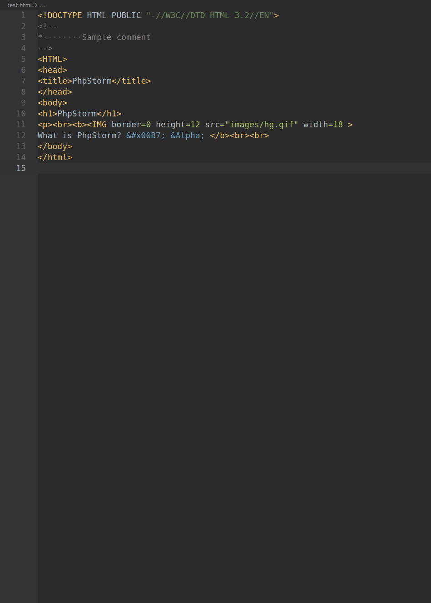

# VS Code Theme Extension - Darcula
A theme extension for VS Code based on Darcula from JetBrains.

## Preview


## Description
- Based on text mate grammar.
- Declaration of className/functionName/methodName are set to bold.
- Some popular languages are tested, PHP/Go/Java/HTML/CSS/JavaScript...
- Please [report issues](https://github.com/sulybot/vscode-theme-darcula/issues) on Github repo if any mistake occurred.

## Installation
Launch VS Code Quick Open (Ctrl+P), paste the following command, and press enter.
```
ext install sulybot.vscode-theme-darcula
```

**Enjoy!**
